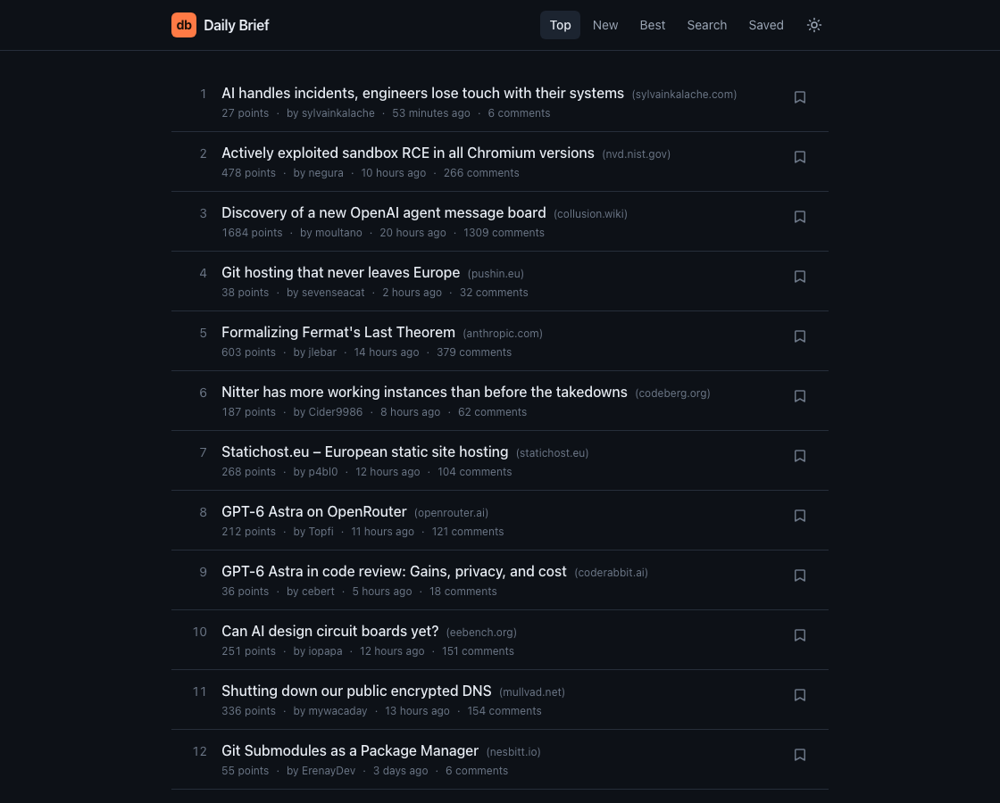
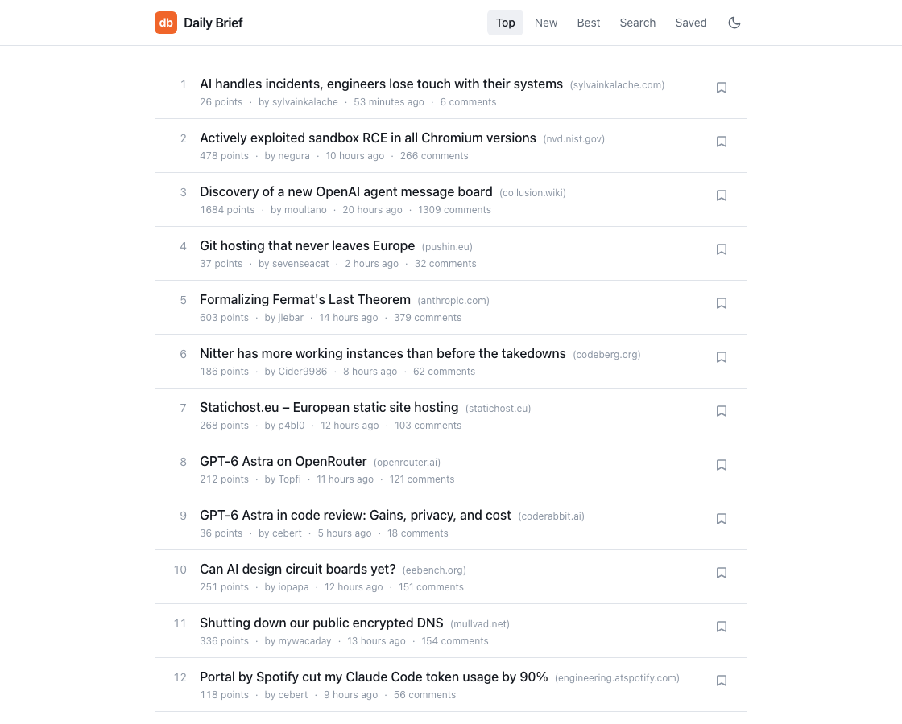

# Daily Brief

**[Open Daily Brief](https://mrnednick.github.io/daily-brief/)**

A calm Hacker News reader: three feeds, threaded discussions, full-text search,
and saved stories that open with no connection at all.



Built with **Svelte 5** and **SvelteKit 2** — deliberately, to work with runes
rather than port habits from another framework. What that changed in practice is
written up at the bottom.

<details>
<summary>The same feed in light theme</summary>



</details>

## What it does

- **Three feeds** — top, new and best, paged in as you scroll, 20 stories at a
  time. The feed you were last on is the one that opens next time.
- **Threaded discussions** — the comment tree with indentation, per-branch
  collapsing that reports how many replies it hid, and on-demand loading for
  branches deeper than the initial fetch.
- **Save for offline** — a saved story is stored **with its comment tree** in
  IndexedDB. Offline, it opens in full; an unsaved one says so instead of
  showing an empty screen.
- **Search** — full-text across all of Hacker News through the Algolia API,
  debounced and abortable, with matches highlighted in the results.
- **Read state, themes** — visited stories dim, light/dark follows the OS until
  you pick one, and the choice is applied before first paint.

No account, no tracking, no backend of its own — just the public
[Hacker News API](https://github.com/HackerNews/API).

## Running it

Requires Node 22 (see `.nvmrc`).

```bash
npm install
npm run dev
```

```bash
npm test        # 20 unit tests (Vitest)
npm run lint    # svelte-check, zero errors
npm run build   # static production build
```

## How it is put together

```
src/lib/api/      typed adapter over the HN Firebase and Algolia APIs
src/lib/state/    runes-based state: prefs, one controller per feed, library
src/lib/db.ts     IndexedDB (idb) — saved stories with comments, read marks
src/lib/utils/    pure helpers: sanitising, relative time, highlighting
src/routes/       feed, discussion, saved, search
```

The data layer is deliberately dumb — it fetches and maps, and knows nothing
about components. Everything stateful lives in three small classes, and the
components read them directly.

**Fetching a comment tree is the one genuinely tricky part.** A front-page
thread is a few hundred comments across a dozen levels. The obvious recursive
walk fetches them one node at a time and takes tens of seconds; `api/tree.ts`
does a breadth-first traversal instead, sending each level as one batch, with a
node cap so a 1,300-comment thread still opens promptly. The remainder keeps
its ids, which is what the "load more replies" buttons are made of.

The site is fully static (`adapter-static`). Story ids cannot be known at build
time, so `/item/[id]` is served from the SPA fallback and resolved in the
browser.

## What Svelte 5 actually changed

The reason this project exists — three things that are genuinely different from
Vue or React, all of them found by getting them wrong first:

1. **State is a plain class field.** `FeedController` and `Library` are ordinary
   classes whose fields are declared with `$state`. No store factory, no
   `subscribe`, no `$` prefix at the call site: a component writes
   `library.savedIds.has(id)` and re-renders when that changes. Derived values
   are `$derived` on the same class. This is the part that removes the most
   ceremony compared to what it replaces.

2. **Runes proxy objects and arrays — not `Set` and `Map`.** `$state(new Set())`
   updates when reassigned and stays silent on `.add()`, so a bookmark button
   flips in the data and never re-renders. The fix is `SvelteSet` from
   `svelte/reactivity`, and the same applies to `Map`.

3. **Reactive state is a Proxy, and structured clone refuses to clone one.**
   Writing a story straight from state into IndexedDB fails with
   `DataCloneError`. Anything leaving the app for storage — IndexedDB,
   `postMessage`, a worker — has to go through `$state.snapshot()` first.

The measurable side: the whole app ships **115 kB of JavaScript** uncompressed
across all routes, and the production build takes under two seconds.

## Measured

Lighthouse against the production build (`npm run build`, served statically,
mobile profile):

| Performance | Accessibility | Best practices | SEO |
|---|---|---|---|
| 91 | 100 | 100 | 100 |

No failing audits; CLS is 0 and total blocking time is 0 ms. Largest
contentful paint is 3.4 s on a throttled mobile connection, and that is the
honest ceiling of the design: the page is static, so the first stories cannot
appear until the browser has asked the Hacker News API for the id list and then
for twenty items. Serving them from a cache or a server would beat it — at the
cost of having a server.

## Deploy

Published on [GitHub Pages](https://mrnednick.github.io/daily-brief/). Pushes to
`main` run type checks, tests and a production build before deployment.

For the Pages build, set `GITHUB_PAGES=true`; links and assets then use
`/daily-brief`. Without this flag the build targets a domain root. Static routes
use directory indexes, while unknown story routes load the `404.html` app shell
and resolve in the browser. GitHub Pages returns HTTP 404 for that fallback even
when the discussion loads successfully.

```bash
npm run build
npm run preview
```
