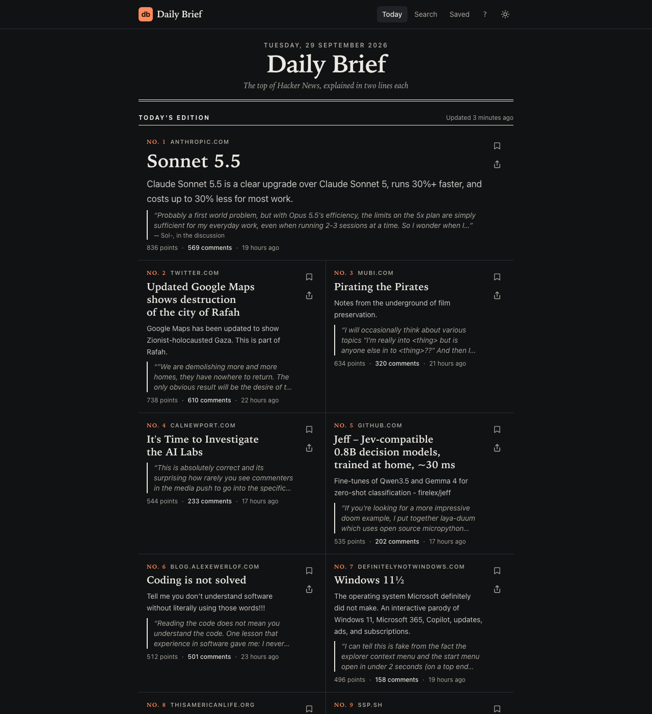
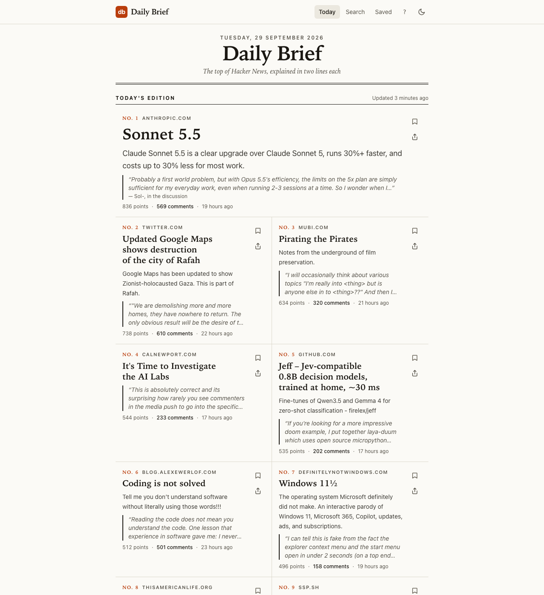

# Daily Brief

**[Open Daily Brief](https://mrnednick.github.io/daily-brief/)**

**Today's edition of Hacker News, explained.** Open it in the morning and one
screen tells you what the site talked about in the last 24 hours — every
headline with two lines on what it actually is and one line from the
discussion, so a title like "Sonnet 5.5" never leaves you guessing. Then a real
story from this same date years ago, then the feeds.



Built with **Svelte 5** and **SvelteKit 2** — deliberately, to work with runes
rather than port habits from another framework. What that changed in practice is
written up at the bottom.

<details>
<summary>The same page in light theme</summary>



</details>

## What it does

- **Today's edition** — the nine highest-scoring stories posted in the last
  24 hours, laid out like a front page: one lead, eight below it, each with its
  site, points, comment count and age.
- **What it is about** — under every headline, the article's own two-line
  summary and the first reply from the discussion that says something in its
  own words. The story page opens with the same summary and a link to the
  original.
- **On this day** — "12 years ago on Hacker News": a real story from this
  calendar date in an earlier year, with its discussion. The year is picked
  from the date, so it changes daily; if that year has nothing (before HN
  existed, 29 February), the card moves to the neighbouring year rather than
  going blank.
- **Works offline** — the edition and the daily card are kept in IndexedDB.
  Without a connection the page opens with the last copy and says how old it is.
- **Feeds and sections** — Top, New and Best, plus Show HN, Ask HN and Jobs,
  paged in as you scroll. The last feed you read opens next time.
- **Topics** — AI, programming, science and security. The rules are plain
  domain and keyword lists in one file (`src/lib/utils/topics.ts`), tested, so
  what a filter shows is predictable. Feed and topic are in the URL.
- **Threaded discussions** — the comment tree with per-branch collapsing that
  reports how many replies it hid, and on-demand loading of deep branches.
- **Save for offline** — a saved story is stored **with its comment tree**, so
  it opens in full on a plane.
- **Keyboard reading** — `j`/`k` move between stories, `o` opens, `c` opens
  the discussion, `s` saves, `?` lists the keys. They stay quiet while you type.
- **Share** — the system share sheet on phones; on desktop, copy a link to the
  article or to the discussion here, or send it to Telegram. Discussion links
  open directly.
- **Search** — full-text across all of Hacker News through Algolia, debounced
  and abortable, with matches highlighted.

No account, no tracking, no backend of its own — just the public
[Hacker News API](https://github.com/HackerNews/API) and its
[Algolia search index](https://hn.algolia.com/api).

## Running it

Requires Node 22 (see `.nvmrc`).

```bash
npm install
npm run dev
```

```bash
npm test        # 46 unit tests (Vitest)
npm run lint    # svelte-check, zero errors
npm run build   # static production build
```

## How it is put together

```
src/lib/api/      typed adapter over the HN Firebase and Algolia APIs;
                  brief.ts builds the edition and the "on this day" card
src/lib/state/    runes-based state: prefs, edition, one controller per feed, library
src/lib/db.ts     IndexedDB (idb) — saved stories, read marks, the last edition
src/lib/utils/    pure helpers: sanitising, relative time, topics, shortcuts
src/routes/       today's edition, discussion, saved, search
```

The data layer is deliberately dumb — it fetches and maps, and knows nothing
about components. Everything stateful lives in three small classes, and the
components read them directly.

**How the edition is built.** Every hour a scheduled GitHub Actions job runs
`scripts/build-edition.ts` before the site is built. It takes the day's top
stories, reads the head of each article for its `og:description` (or the post
text for Ask HN and Show HN), picks the first substantive top-level reply, and
writes `edition.json` next to the app — no API keys, no paid services. The job
cannot break the site: an article that times out just has no summary, a failed
search carries the live edition over, and the app itself falls back to the live
Hacker News search whenever the file is missing or more than three hours old,
still matching whatever summaries the file has by story id. The parsing lives in
`src/lib/api/gist.ts` and is tested on recorded HTML.

**The edition comes from Algolia, not the Firebase API.** Firebase only has
ranked id lists; "the biggest stories of the last 24 hours" and "this date in
2014" are time-window queries, which the Algolia index answers in one request
each (`numericFilters=created_at_i>…`, with the operator percent-encoded — a
raw `>` is rejected before it reaches Algolia). The tests run against recorded
responses in `src/lib/api/fixtures/`, not the network.

**Fetching a comment tree is the other genuinely tricky part.** A front-page
thread is a few hundred comments across a dozen levels. The obvious recursive
walk fetches them one node at a time and takes tens of seconds; `api/tree.ts`
does a breadth-first traversal instead, sending each level as one batch, with a
node cap so a 1,300-comment thread still opens promptly. The remainder keeps
its ids, which is what the "load more replies" buttons are made of.

The site is fully static (`adapter-static`). Story ids cannot be known at build
time, so `/item/[id]` is served from the SPA fallback and resolved in the
browser.

## What Svelte 5 actually changed

The reason this project exists — four things that are genuinely different from
Vue or React, all of them found by getting them wrong first:

1. **State is a plain class field.** `FeedController` and `Library` are ordinary
   classes whose fields are declared with `$state`. No store factory, no
   `subscribe`, no `$` prefix at the call site: a component writes
   `library.savedIds.has(id)` and re-renders when that changes. Derived values
   are `$derived` on the same class. This is the part that removes the most
   ceremony compared to what it replaces.

2. **Runes proxy objects and arrays — not `Set` and `Map`.** `$state(new Set())`
   updates when reassigned and stays silent on `.add()`, so a bookmark button
   flips in the data and never re-renders. The fix is `SvelteSet` from
   `svelte/reactivity`, and the same applies to `Map`.

3. **Reactive state is a Proxy, and structured clone refuses to clone one.**
   Writing a story straight from state into IndexedDB fails with
   `DataCloneError`. Anything leaving the app for storage — IndexedDB,
   `postMessage`, a worker — has to go through `$state.snapshot()` first.

4. **An effect tracks everything it reads — including inside the method it
   calls.** The front page's effect called `feed.load()`, which reads the
   feed's own `loading` flag. Online nobody noticed; offline, every failed
   request flipped the flag, re-ran the effect and retried at once, and the
   tab froze. Calls that are actions, not dependencies, go through `untrack`.

The measurable side: the whole app ships **139 kB of JavaScript** uncompressed
(51 kB gzipped) across all routes, and the production build takes about two
seconds.

## Measured

Lighthouse against the production build (`npm run build`, served statically):

| Profile | Performance | Accessibility | Best practices | SEO |
|---|---|---|---|---|
| Mobile | 96 | 100 | 100 | 100 |
| Desktop | 99 | 100 | 100 | 100 |

Headlines use the system serif stack rather than a web font, so the
newspaper look costs no download. The API hosts are preconnected, which is
the rest of what can be done for a static page: the stories themselves cannot
appear before the browser has asked Hacker News for them.

## Deploy

Published on [GitHub Pages](https://mrnednick.github.io/daily-brief/). Pushes to
`main` and an hourly schedule run type checks, tests, the edition build and a
production build before deployment.

For the Pages build, set `GITHUB_PAGES=true`; links and assets then use
`/daily-brief`. Without this flag the build targets a domain root. Static routes
use directory indexes, while unknown story routes load the `404.html` app shell
and resolve in the browser. GitHub Pages returns HTTP 404 for that fallback even
when the discussion loads successfully.

```bash
npm run build
npm run preview
```
